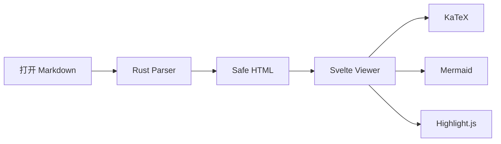

# Markdown Viewer v0.7

这是 v0.7 富渲染、右键菜单、复制和链接安全验证文档。搜索关键词：**Viewer**、Viewer、viewer。

## 数学公式

行内公式：$E = mc^2$。

块级公式：

$$
\int_0^1 x^2 \, dx = \frac{1}{3}
$$

## Mermaid



## Rust

```rust
pub trait DocumentFormat {
    fn id(&self) -> &'static str;
    fn render(&self, input: &DocumentInput) -> Result<RenderedDocument, CoreError>;
}
```

## TypeScript

```ts
export function openViewer(path: string) {
  console.log(`Open: ${path}`);
}
```

Setext Heading
--------------

这段用于验证 Setext Heading 也能进入目录。

## 重复标题

第一个重复标题。

## 重复标题

第二个重复标题应该获得 `重复标题-1` 一类的稳定 ID。

## Raw HTML 安全验证

下面的 HTML 应该作为文字显示，而不是执行：

<script>alert("should not run")</script>

## 本地资源

下面的图片使用相对路径，桌面版应通过 Tauri asset protocol 显示，但只授权这一张实际引用的文件：


[打开同目录 Markdown 并跳到指定标题](./linked-document.md#jump-target)

[外部链接在系统浏览器打开](https://tauri.app/)


## v0.7 右键与复制测试

请选择这一段 **包含粗体、`code` 和 [外链](https://example.com/)** 的文字后右键，验证纯文本、富文本、HTML 和“查找选中文字”。

也可以直接右键上面的外部链接或同目录 Markdown 链接。
